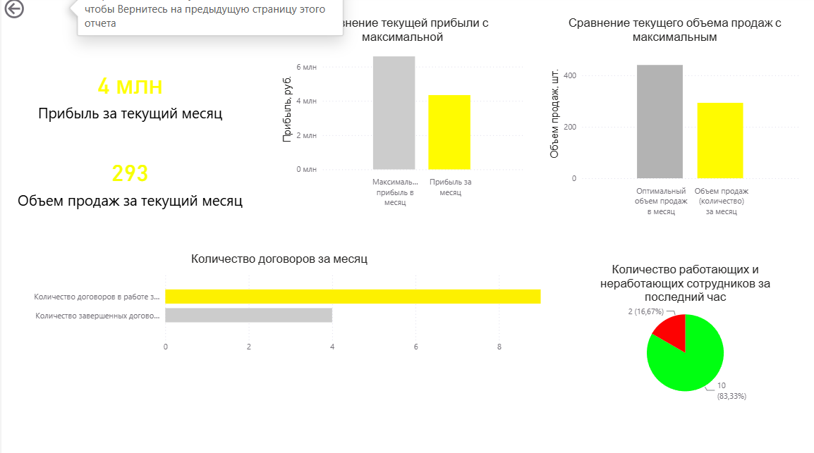
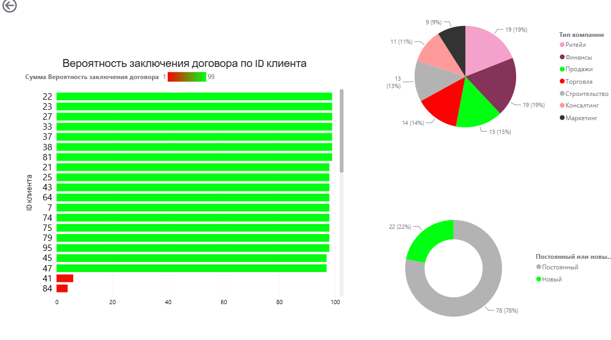
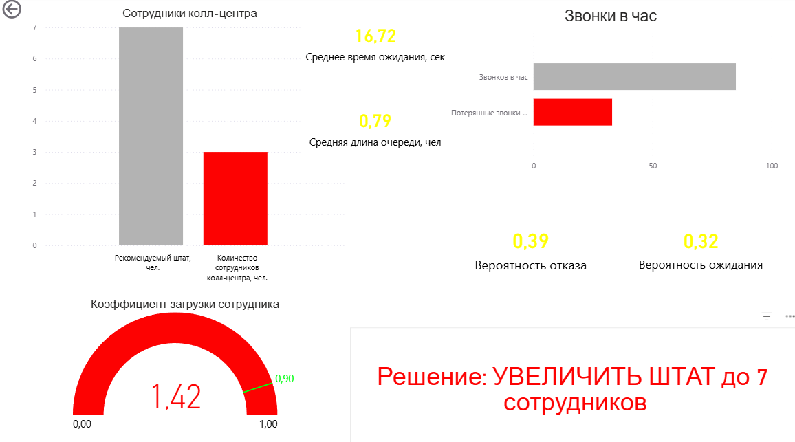

# CD1 — Decision Support System

**Business Analytics · Data Mart · Queueing Theory · Optimization · Machine Learning · Power BI**

A portfolio prototype of a **data-driven decision-support system for customer service and sales management**. The project connects operational data, KPI calculation, queueing simulation, optimization, leakage-free client scoring and Power BI reporting into one analytical workflow.

> **Project status:** academic / portfolio prototype. The included business data is synthetic. Google Colab / Google Sheets were used in the original implementation.

## What problem does it solve?

Management needs to answer four practical questions:

1. **What is happening with the business?** — profit, sales, contracts and staffing KPIs.
2. **Is the service operation overloaded?** — waiting time, queue length, abandonment and utilization.
3. **How many employees are needed?** — simulation-based staff recommendation.
4. **Which clients deserve priority?** — a contract-propensity score based only on information available before the outcome.

## End-to-end architecture

```text
                     ┌──────────────────────────┐
                     │ Synthetic / source data  │
                     │ Google Sheets / Excel    │
                     └────────────┬─────────────┘
                                  │
                                  ▼
                     ┌──────────────────────────┐
                     │   Data Mart / KPI layer  │
                     │ profit • sales •         │
                     │ contracts • staffing    │
                     └───────┬─────────┬────────┘
                             │         │
                 ┌───────────┘         └──────────────┐
                 ▼                                    ▼
      ┌──────────────────────┐             ┌──────────────────────┐
      │ Queueing simulation  │             │ Leakage-free ML      │
      │ M/M/m + patience     │             │ Random Forest        │
      └──────────┬───────────┘             └──────────┬───────────┘
                 │                                    │
                 ▼                                    ▼
      ┌──────────────────────┐             ┌──────────────────────┐
      │ Staff recommendation │             │ Client prioritizing  │
      │ + service metrics    │             │ / propensity score   │
      └──────────┬───────────┘             └──────────┬───────────┘
                 └────────────────┬───────────────────┘
                                  ▼
                       ┌────────────────────────┐
                       │     Power BI report    │
                       │  management decisions  │
                       └────────────────────────┘
```

## Project components

### 1. Data generation and scheduled updates

`legacy/01_data_generation_colab_export.py`

The original script creates the `ЦД1` Google Spreadsheet and populates four business datasets:

- **Деньги** — expenses and sales volume;
- **Сотрудники** — number of active employees and calls per hour;
- **Клиенты** — historical new / completed contracts;
- **Клиенты_компании** — synthetic company-client profiles.

It also configures APScheduler jobs for recurring updates. This is preserved as the original Colab implementation.

### 2. Data Mart and KPI layer

`notebooks/02_queueing_optimization_and_datamart.ipynb`

The notebook contains Data Mart logic, KPI aggregation and an optimization block. The business-logic workbook documents KPI definitions and scoring rules.

Key modeled outputs include:

- monthly profit;
- sales volume;
- new and completed contracts;
- current contract count;
- modeled maximum / optimal sales volume;
- modeled maximum profit.

### 3. Queueing model and staff optimization

The analytical notebook contains an **M/M/m-style queueing simulation with limited customer patience**. It models incoming calls, service completion, queueing and abandonment across repeated replications.

Main outputs:

- current staffing;
- recommended staffing;
- calls per hour;
- utilization `ρ`;
- average waiting time;
- average queue length;
- abandonment probability;
- lost calls per hour.

The supplied dashboard snapshot contains a recommendation to increase staffing from **3 to 7 employees** under the modeled scenario.

### 4. Leakage-free client scoring

`src/contract_prediction.py`

This is the corrected version of the original Random Forest client-scoring block.

The original implementation created the target from **Стадия работы с клиентом** and also included that same field among model features.

The corrected model follows a strict feature policy:

- **Тип компании**;
- **Прибыль компании-клиента**;
- **Постоянный или новый клиент**;
- **Потребность клиента в товаре**.

`Стадия работы с клиентом` is treated as **post-outcome information** and is not allowed into the feature matrix.

The module also provides:

- hold-out evaluation (`accuracy`, `precision`, `recall`, `F1`, `ROC-AUC`);
- 5-fold out-of-fold scoring for all synthetic clients;
- scoring of genuinely new clients using only pre-outcome fields;
- reproducible synthetic modeling data where the outcome is generated from pre-outcome characteristics.

A reproducible notebook is available at `notebooks/03_contract_prediction_leakage_free.ipynb`.

### 5. Power BI reporting

`dashboard/CD1_dashboard.pbix`

The report is represented by three supplied business views:

- **Management / CD1** — financial and sales KPIs;
- **Client scoring / CD2** — client contract probabilities and client composition;
- **Call center / CD3** — staffing, queueing, waiting, lost calls and recommendation.

> **Important:** the PBIX file and screenshots are retained as the original visual prototype. The corrected ML methodology is implemented in `src/contract_prediction.py` and `notebooks/03_contract_prediction_leakage_free.ipynb`; the PBIX has not been silently presented as if its historical client scores were recalculated with the corrected methodology.

## Business value

The project demonstrates a complete decision-support loop:

- **KPI analytics** tells management what is happening;
- **queueing theory** explains service-capacity problems;
- **optimization** supports resource decisions;
- **machine learning** supports client prioritization without post-outcome leakage;
- **Power BI** brings the outputs into a management interface.

## Data and artifacts

| Artifact | Purpose |
|---|---|
| `data/sample/CD1_source_data.xlsx` | Sample source dataset with money, staff, contracts and company-client data |
| `data/sample/CD1OV_analytics.xlsx` | Original normalized client data, model-result snapshot and SМО output |
| `data/sample/Data_Mart.xlsx` | Original Data Mart snapshot |
| `data/sample/Data_Mart_business_logic.xlsx` | Business definitions and KPI scoring logic |
| `data/sample/modeling_clients.csv` | Clean synthetic lead-level dataset for the leakage-free ML example |
| `data/sample/contract_scores_oof.csv` | Out-of-fold contract propensity scores for the clean ML example |
| `dashboard/CD1_dashboard.pbix` | Power BI report snapshot from the original prototype |
| `dashboard/screenshots/` | Portfolio screenshots of the report |

## ML methodology: what was fixed

The old prototype had a classic target-leakage pattern:

```text
Стадия работы с клиентом
        │
        ├──> defines target: Договор_заключен
        │
        └──> also used as a model feature   ← leakage
```

The corrected version uses:

```text
Pre-outcome client attributes
        │
        ▼
Random Forest
        │
        ▼
Contract propensity
```

The stage field may still exist in the raw business dataset, but it is excluded from the predictive feature matrix.

For the portfolio benchmark, the outcome is generated from pre-outcome attributes so the notebook demonstrates an actual predictive setup rather than simply learning a post-outcome label.

## Limitations

### Synthetic data

The supplied business data is generated / simulated rather than real corporate data. The repository therefore demonstrates methodology and engineering, not real-world model validity.

### Model validation

The corrected notebook uses a hold-out test and out-of-fold predictions. Reported metrics are only valid for the included synthetic benchmark.

### Google Colab dependency

The original scripts use Google authentication and Google Sheets. Credentials are not stored in the repository.

### Power BI snapshot

The PBIX file is a portfolio visualization artifact from the original implementation. Its client-scoring page should not be used as evidence of the corrected model's performance.

## Portfolio positioning

> **A data-driven decision-support prototype for customer service and sales management, combining Data Mart design, KPI analytics, queueing simulation, optimization, leakage-free machine learning and BI reporting.**

Relevant roles:

**Business Analyst · Data Analyst · BI Analyst · Operations / Decision Science · Junior Data Scientist · Business Transformation Consultant**

## Power BI preview

### Management dashboard



### Client scoring



### Queueing / staffing



## Quick start

```bash
git clone <YOUR_GITHUB_REPOSITORY_URL>
cd cd1-decision-support-system
python -m venv .venv
# activate the environment for your OS
pip install -r requirements.txt

python src/contract_prediction.py
python -m pytest -q
```

The original Google Colab workflow remains under `legacy/` and the queueing / Data Mart notebook remains under `notebooks/02_queueing_optimization_and_datamart.ipynb`.

## Repository map

```text
cd1-decision-support-system/
├── README.md
├── requirements.txt
├── LICENSE
├── .gitignore
├── src/
│   └── contract_prediction.py
├── tests/
│   └── test_contract_prediction.py
├── legacy/
│   ├── 01_data_generation_colab_export.py
│   └── 03_contract_prediction_colab_export.py
├── notebooks/
│   ├── 02_queueing_optimization_and_datamart.ipynb
│   └── 03_contract_prediction_leakage_free.ipynb
├── data/
│   └── sample/
│       ├── CD1_source_data.xlsx
│       ├── CD1OV_analytics.xlsx
│       ├── Data_Mart.xlsx
│       ├── Data_Mart_business_logic.xlsx
│       ├── modeling_clients.csv
│       └── contract_scores_oof.csv
├── dashboard/
│   ├── CD1_dashboard.pbix
│   └── screenshots/
└── docs/
    ├── ARCHITECTURE.md
    ├── DATA_DICTIONARY.md
    ├── ML_METHODOLOGY.md
    └── PORTFOLIO_NOTES.md
```
